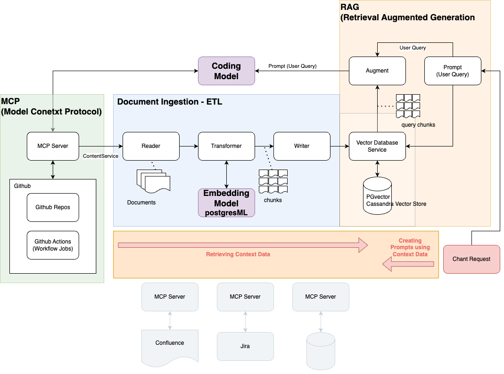

# springpr-ai-parent-framework
GenAI Frameworks integrated from and based on Spring AI.

## Components

This application is an out-of-box working test bed for the following GenAI components:

* Chat Model
* Chat Memory
* Coding Model
* Embedding Model
* RAG with ETL
* Vector Database
* MCP
* MCP Github Services

## Architecture

## Contributing

We welcome Your interest in the American Express Open Source Community on GitHub. Any Contributor to
any Open Source Project managed by the American Express Open Source Community must accept and sign
an Agreement indicating agreement to the terms below. Except for the rights granted in this
Agreement to American Express and to recipients of software distributed by American Express, You
reserve all right, title, and interest, if any, in and to Your Contributions. Please
[fill out the Agreement](https://cla-assistant.io/americanexpress/springpr-ai-framework).

## License

Any contributions made under this project will be governed by the
[Apache License 2.0](documents/LICENSE.txt).

## Code of Conduct

This project adheres to the [American Express Community Guidelines](documents/CODE_OF_CONDUCT.md). By
participating, you are expected to honor these guidelines.

## American Express Responsible Disclosure Policy

All American Express open source projects are covered by [American Express Responsible Disclosure](documents/SECURITY.md).
