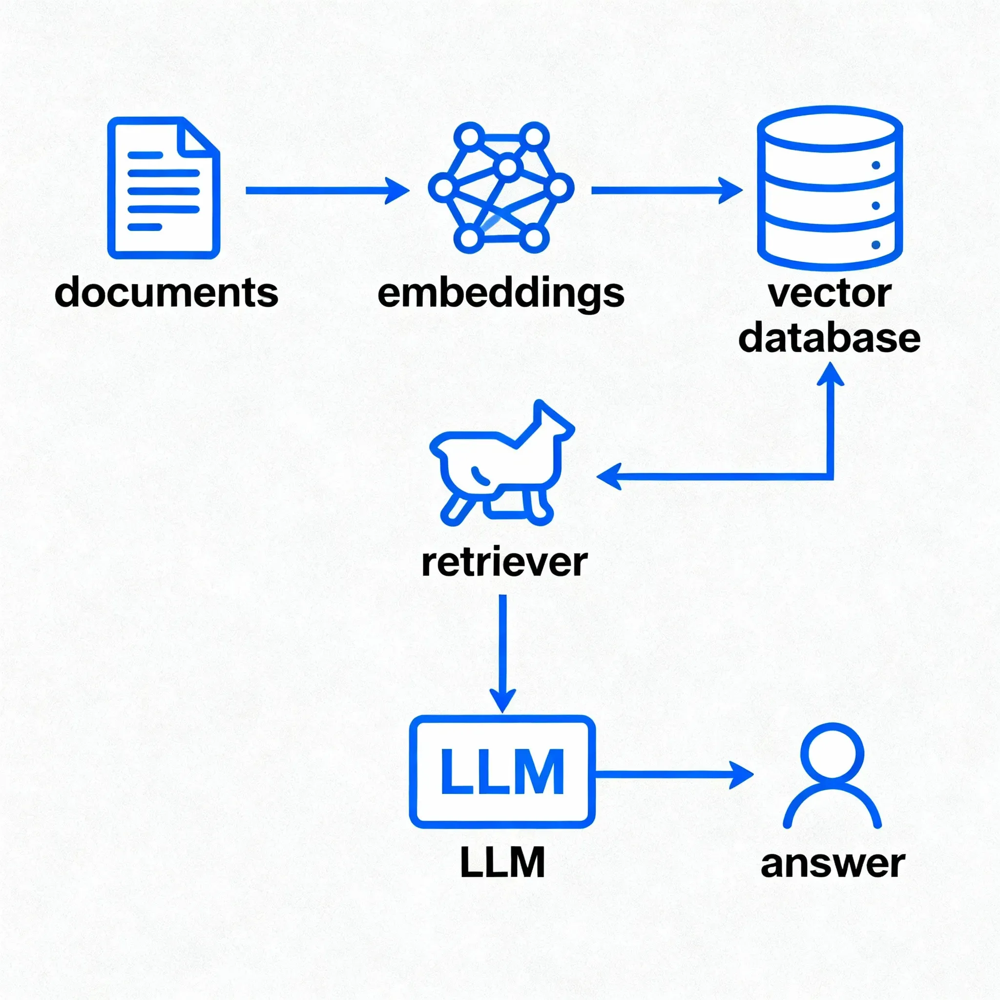

[Spring AI Demo](https://github.com/joshlong-attic/2025-05-16-anthropic)

### required components
* psql
* Postgresml
* Ollama

### Docker Postgresml Installation

```
docker pull ghcr.io/postgresml/postgresml:2.9.3
```

```
docker run \
    -it \
    -v postgresml_data:/var/lib/postgresql \
    -p 5433:5432 \
    -p 8000:8000 \
    ghcr.io/postgresml/postgresml:2.9.3 \
    sudo -u postgresml psql -d postgresml
    # && CREATE ROLE myappuser WITH LOGIN PASSWORD 'mypassword';
```

### Check if psql installed

```
whereis psql
```
### Install psql

```
brew install postgresql
```

```
export PATH="/opt/homebrew/opt/postgresql@<version>/bin:$PATH"
```

### Schema and Data

```
chmod u+x init.sh
```

```
./init.sh
```

[Setup with PostgreSQL and pgvector](https://dev.to/yukaty/setting-up-postgresql-with-pgvector-using-docker-hcl)

### Ollama Installation

```
docker run -d -v ollama:/root/.ollama -p 11434:11434 --name ollama ollama/ollama
```

```
docker exec -it ollama ollama pull mxbai-embed-large
```

```
docker exec -it ollama ollama pull mistral
```

## RAG Setup

mxbai-embed-large:latest is an open-source embedding model available in Ollama, developed by mixedbread.ai. It’s a model for generating vector representations of text, optimized for tasks like retrieval-augmented generation (RAG).


```
docker exec -it ollama ollama show mxbai-embed-large
```

```
docker exec -it ollama ollama list
```
